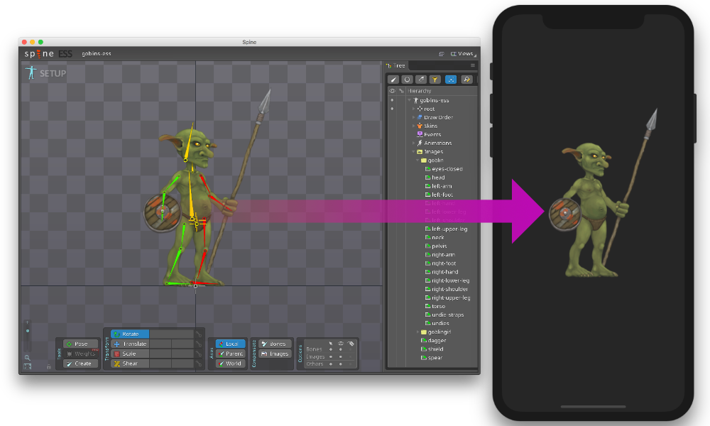
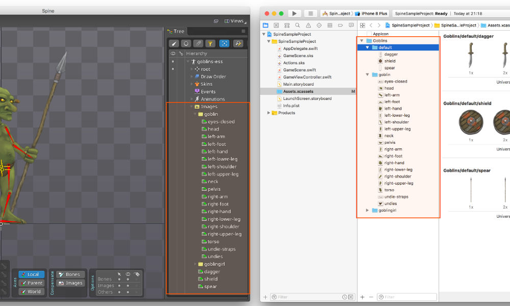
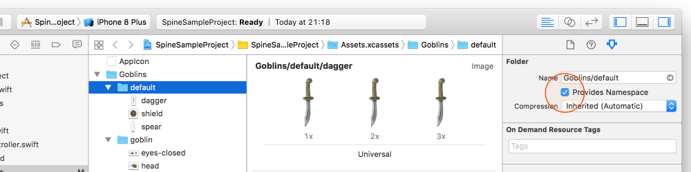
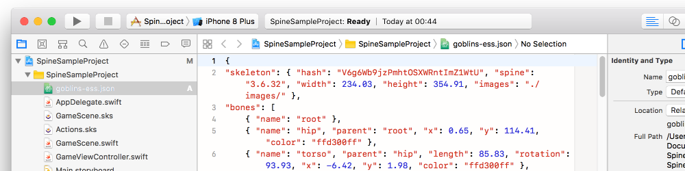
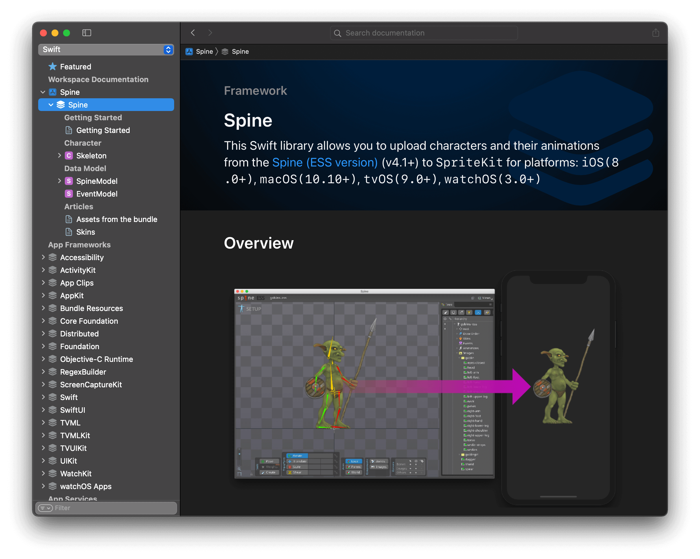

# Spine
This Swift library allows you to upload characters and their animations from the [Spine (ESS version)](http://esotericsoftware.com) (v4.1+) to `SpriteKit` for platforms::

`iOS` `macOS` `tvOS` `watchOS`

Implemented almost all the functionality of the essential version of Spine app:
Animation of bones, skins, animation of slots, creation of physical bodies on the basis of bounding boxes and some other. See [Implemented Features](#implemented-features) for more information.

>Warning: There is no implementation of Spine Pro functionality and it is not planned. There are no such features as meshes and their animations. Moreover, when trying to load a character from Spine Pro version with meshes, it will not even be displayed correctly on the screen, a lot of textures will be missing.

Example of working with the library: [Sample project](https://github.com/maxgribov/SpineSampleProject)<BR>
Learn more about working with the library: [Spine Wiki](https://github.com/maxgribov/Spine/wiki)
You can also compile the documentation in Xcode



## Installing
Spine Library can be installed using Swift Package Manager.

Use the package URL to search for the URLImage package: [https://github.com/maxgribov/Spine](https://github.com/maxgribov/Spine)

For how-to integrate package dependencies refer to [Adding Package Dependencies to Your App documentation.](https://developer.apple.com/documentation/xcode/adding-package-dependencies-to-your-app)

## Basic Usage

### Assets

#### Files

1. In `Assets` catalog create `folder`. *(`Goblins` folder in example below)*
2. Create `sprite atlases`. *(`default`, `goblin` and `goblingirl` sprite atlases in example below)*
3. Put images into sprite atlaces. 
>Note: Note that the images that are in the `root` folder of the Spine app project must be in the sprite atlas named `default` in the Xcode project.

Final result should looks something like this:



#### Namespace

Set `Provides Namespace` option enabled for the root folder and for all sprite atlases in the Xcode's attribute inspector:



>Warning: If you forget to set the namespace, later when you initialize your character images can be just not found.

#### JSON

Put the JSON exported from the Spine application somewhere in your project:



For more information about assets see [Assets Wiki](https://github.com/maxgribov/Spine/wiki/Assets)

### Code

Somewhere at the beginning of your code, import the `Spine` library:

```swift
import Spine
```

The easiest way to load a character from a `JSON` file and apply skin to it is to use the appropriate `Skeleton` class init:

```swift
let character = try Skeleton(json: "goblins-ess", folder: "goblins", skin: "goblin")
```
>[Skeleton](Spine/Skeleton.swift) is a subclass of `SKNode`, so you can do with it whatever you can do with `SKNode` itself

This way you can apply the animation created in Spine to the character:

```swift
let walkAnimation = try character.action(animation: "walk")
character.run(walkAnimation)
```
>The `action(animation:)` method returns an object of the `SKAction` class so that you can use this animation as any other object of the `SKAction` class

This is an example of the simplest scene in which we load our Goblin character, add it to the scene and start walk animation in an endless loop:
```swift
import SpriteKit
import Spine

class GameScene: SKScene {
    
    override func didMove(to view: SKView) {
        
        do {
            
            let character = try Skeleton(json: "goblins-ess", folder: "goblins", skin: "goblin")
            character.name = "character"
            character.position = CGPoint(x: self.size.width / 2, y: (self.size.height / 2) - 200)
            addChild(character)
            
            let walkAnimation = try character.action(animation: "walk")
            character.run(.repeatForever(walkAnimation))

        } catch {
            
            print(error)
        }
    }
}
```

## Implemented Features

| Name | Model | Feature | Animation |
| --- | :---: | :---: | :---: |
| **Bones** |  |  |  |
| - Rotation | + | + | + |
| - Translation | + | + | + |
| - Scale | + | + | + |
| - Shear | + | - | - |
| *Bones extras:* |  |  |  |
| - Reflect | + | - | |
| - Rotation Inheritance | + | - | |
| - Scale Inheritance | + | - | |
| - Reflect Inheritance | + | - | |
| **Slots** |  |  |  |
| - Attachment | + | + | + |
| - Tint Color | + | + | +/- |
| - Dark Tint Color | + | - |  |
| **Skins** | + | + |  |
| **Attachments** |  |  |  |
| - Region | + | + |  |
| - Mesh | + | - | - |
| - Linked Mesh | + | - | - |
| - Bounding Box | + | + | - |
| - Path | + | - | - |
| - Point | + | + |  |
| - Clipping | + | - | - |
| **Constraints** |  |  |  |
| - IK Constraint | + | - | - |
| - Transform Constraint | + | - | - |
| - Path Constraint | + | - | - |
| **Events** | + | + | + |
| **Draw Order** | + | + | + |

## Documentation
The Spine library is pretty well documented. You can find the documentation both in the source code files themselves and compile the documentation for displaying it in the Developer Documentation in Xcode.

To compile the documentation use the menu: `Product` > `Build Documentation`

Or use a shortcut: `ctrl` + `shift` + `command` + `D`

As a result, the Developer Documentation will open and you will see something like this:



## System Requirements

**Swift 5.0**
* iOS 8.0+
* macOS 10.10+
* tvOS 9.0+
* watchOS 3.0+

## License

This project is licensed under the MIT License - see the [LICENSE](LICENSE) file for details

## Useful links

* Spine user guide: http://esotericsoftware.com/spine-user-guide
* Spine JSON format documentation: http://esotericsoftware.com/spine-json-format
* Spine oficial runtimes: https://github.com/EsotericSoftware/spine-runtimes
