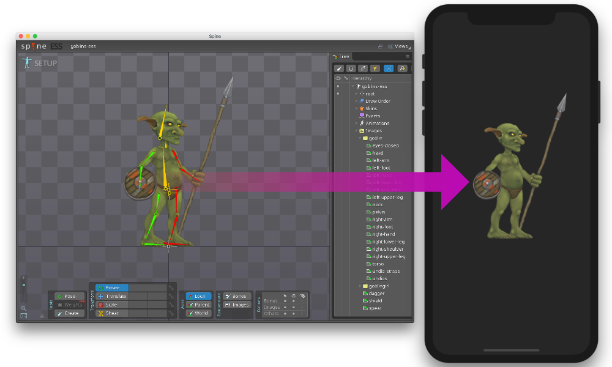
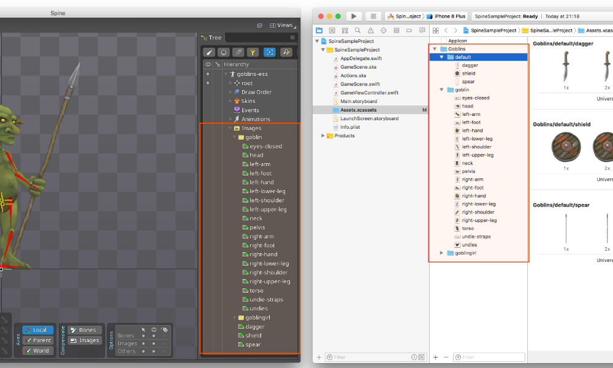
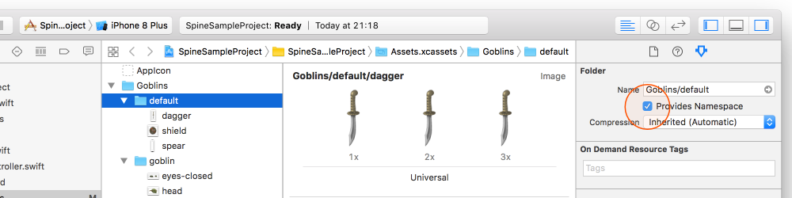
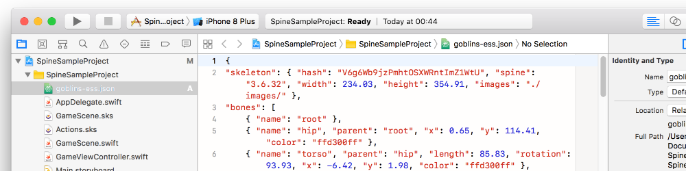
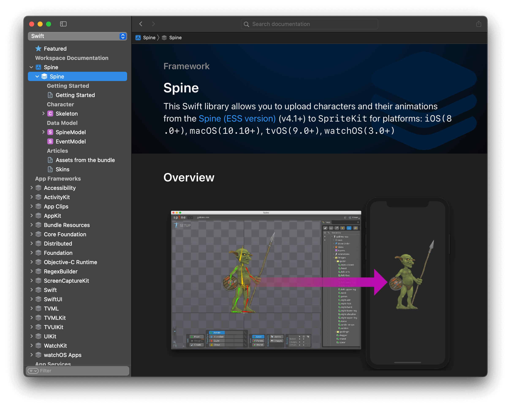

# Spine
A Swift library for loading Spine 4.1 characters and playing their animations natively in SpriteKit.

The existing runtime supports Essential animations on **iOS, macOS, tvOS and watchOS**. An opt-in mesh runtime adds **ordinary, weighted and linked meshes with deform animations on iOS and macOS**, rendered with SpriteKit nodes and shaders.

Existing `Skeleton(json:folder:skin:)` clients continue to use the legacy runtime without code changes. To enable meshes, use `SpineMeshAsset` and `Skeleton(meshAsset:)` and prepare the character after each scene update. Both entry points share the same JSON decoder; mesh assets additionally validate the supported Spine **4.1.x** features. Compatibility with other export versions is not guaranteed.

Mesh support does not cover every Spine Pro feature. Constraints, clipping, animation mixing and other limitations are listed [below](#mesh-runtime-limitations).

Example of working with the library: [Sample project](https://github.com/maxgribov/SpineSampleProject)<BR>
Learn more about working with the library: [Spine Wiki](https://github.com/maxgribov/Spine/wiki)
You can also compile the documentation in Xcode



## Installing
Spine Library can be installed using Swift Package Manager.

Add the Spine package using this repository URL: [https://github.com/maxgribov/Spine](https://github.com/maxgribov/Spine)

For how-to integrate package dependencies refer to [Adding Package Dependencies to Your App documentation.](https://developer.apple.com/documentation/xcode/adding-package-dependencies-to-your-app)

## Basic Usage

The following instructions use the existing Essential/legacy API. For mesh characters, see [Mesh Usage](#mesh-usage); their atlas resources are loaded differently.

### Assets

#### Files

1. In `Assets` catalog create `folder`. *(`Goblins` folder in example below)*
2. Create `sprite atlases`. *(`default`, `goblin` and `goblingirl` sprite atlases in example below)*
3. Put images into sprite atlaces. 
>Note: Note that the images that are in the `root` folder of the Spine app project must be in the sprite atlas named `default` in the Xcode project.

Final result should looks something like this:



#### Namespace

Set `Provides Namespace` option enabled for the root folder and for all sprite atlases in the Xcode's attribute inspector:



>Warning: If you forget to set the namespace, later when you initialize your character images can be just not found.

#### JSON

Put the JSON exported from the Spine application somewhere in your project:



For more information about assets see [Assets Wiki](https://github.com/maxgribov/Spine/wiki/Assets)

### Code

Somewhere at the beginning of your code, import the `Spine` library:

```swift
import Spine
```

The easiest way to load a character from a `JSON` file and apply skin to it is to use the appropriate `Skeleton` class init:

```swift
let character = try Skeleton(json: "goblins-ess", folder: "goblins", skin: "goblin")
```
>[Skeleton](Sources/Spine/Skeleton.swift) is a subclass of `SKNode`, so you can do with it whatever you can do with `SKNode` itself

This way you can apply the animation created in Spine to the character:

```swift
let walkAnimation = try character.action(animation: "walk")
character.run(walkAnimation)
```
>The `action(animation:)` method returns an object of the `SKAction` class so that you can use this animation as any other object of the `SKAction` class

This is an example of the simplest scene in which we load our Goblin character, add it to the scene and start walk animation in an endless loop:
```swift
import SpriteKit
import Spine

class GameScene: SKScene {
    
    override func didMove(to view: SKView) {
        
        do {
            
            let character = try Skeleton(json: "goblins-ess", folder: "goblins", skin: "goblin")
            character.name = "character"
            character.position = CGPoint(x: self.size.width / 2, y: (self.size.height / 2) - 200)
            addChild(character)
            
            let walkAnimation = try character.action(animation: "walk")
            character.run(.repeatForever(walkAnimation))

        } catch {
            
            print(error)
        }
    }
}
```

## Mesh Usage

Export a Spine **4.1.x JSON**, its `.atlas` text file and all referenced PNG pages. Include these files as bundle resources. Pass the atlas text and PNG data to `SpineAtlasTextureProvider`, using the exact page names from the atlas as dictionary keys. This path does not use Xcode sprite atlases.

The example below accepts resource contents already loaded by your app:

```swift
import SpriteKit
import Spine

final class MeshScene: SKScene {
    private var character: Skeleton?

    func loadCharacter(jsonData: Data, atlasText: String, pages: [String: Data]) throws {
        let textures = try SpineAtlasTextureProvider(
            atlasText: atlasText,
            pageData: pages
        )
        let asset = try SpineMeshAsset(json: jsonData, textures: textures)
        let goblin = try Skeleton(meshAsset: asset, skin: "goblin")
        goblin.position = CGPoint(x: size.width / 2, y: size.height / 2)
        let walk = try goblin.action(animation: "walk")
        addChild(goblin)
        character = goblin
        goblin.run(.repeatForever(walk), withKey: "walk")
    }

    override func didFinishUpdate() {
        guard let view = view, let character = character else { return }
        do {
            try character.prepareMeshes(in: view)
        } catch {
            print("Mesh preparation failed: \(error)")
        }
    }
}
```

Use the skin and animation names from your export. Call `loadCharacter` once when setting up this scene. You can share one `SpineMeshAsset` across multiple characters; each character has independent playback and skin state.

Call `prepareMeshes(in:)` for every mesh character as the **final operation in `didFinishUpdate`**, after physics, camera movement and manual bone edits. Preparation does not advance animation time. Repeat preparation after late changes, including while paused.

Mesh actions must run on the `Skeleton` that created them, including copies and actions nested in containers. Each character supports one active mesh clip. Before removing or replacing its action, stop playback and obtain a fresh action:

```swift
character.stopMeshAnimation(resetToSetupPose: true)
character.removeAction(forKey: "walk")
let walk = try character.action(animation: "walk")
character.run(.repeatForever(walk), withKey: "walk")
```

Characters render alongside ordinary SpriteKit content. Keep character roots in separate depth bands at least one `zPosition` unit apart when ordering them with the environment. The library preserves the scene's `ignoresSiblingOrder` setting.

See the [mesh API guide](Sources/Spine/Documentation.docc/Meshes.md) for frame contexts, lifecycle rules, skin changes and error handling.

### Mesh runtime limitations

- Mesh rendering is available on **iOS and macOS**. The mesh entry point reports `unsupportedPlatform` on tvOS/watchOS; the existing runtime remains available there.
- Supported attachments include regions, ordinary/weighted meshes, linked meshes, points and static bounding boxes. Atlas loading supports multiple PNG pages, trim, rotation and premultiplied alpha metadata.
- Unsupported asset features, including IK/transform/path constraints, clipping, sequences, shear, non-normal transform inheritance, dark tint and non-normal blending, are rejected with a `SpineRuntimeError` and source path.
- Animation mixing, seeking and reverse playback are not provided. Crop/effect ancestors are unsupported. Mesh preparation is an explicit scene integration step.

### Try the mesh example

On macOS, run from the repository root:

```sh
swift run -c release --package-path Examples/MeshPrototype MeshPrototype --library --integration
```

The example keeps both the prototype and library renderers, with separate demo and environment scenes. **L** switches renderer; **Tab** switches scene. See the [example README](Examples/MeshPrototype/README.md) for controls and verification commands.

## Implemented Features

The table compares runtime behavior, not just JSON decoding. **Legacy** uses the existing constructors; **Mesh runtime** uses `Skeleton(meshAsset:)` on iOS/macOS.

| Feature | Legacy | Mesh runtime |
| --- | --- | --- |
| **Bones** | | |
| Rotation, translation and scale | Setup + animation | Setup + animation |
| Shear | Unsupported | Unsupported |
| Non-normal transform inheritance | Unsupported | Unsupported; normal inheritance only |
| **Slots and skins** | | |
| Attachment switching | Supported + animated | Supported + animated, including hiding attachments |
| Tint color | Setup + partial animation support | Setup + RGB/RGBA/alpha timelines |
| Dark tint | Unsupported | Unsupported |
| Skin switching | Supported | Supported, with compatible deform state preserved |
| **Attachments** | | |
| Region | Supported | Supported |
| Ordinary mesh | Unsupported | Supported + deform animation |
| Weighted mesh | Unsupported | Supported + skinning and deform animation |
| Linked mesh | Unsupported | Supported + deform timeline inheritance |
| Bounding box | Static physics body; no deform animation | Unweighted static physics body; no deform animation |
| Point | Supported | Supported |
| Path | Unsupported | Unsupported |
| Clipping | Unsupported | Unsupported |
| **Constraints** | | |
| IK constraint | Unsupported | Unsupported |
| Transform constraint | Unsupported | Unsupported |
| Path constraint | Unsupported | Unsupported |
| **Animation and rendering** | | |
| Events | Supported | Supported |
| Draw order | Supported + animated | Supported + animated |
| Playback through SKAction | Supported | Supported; one active clip per character |
| Atlas trim, rotation and PMA metadata | Existing Xcode sprite-atlas workflow | Supported through SpineAtlasTextureProvider |

Mesh runtime restrictions and required scene integration are described in [Mesh Usage](#mesh-usage).

## Documentation
The Spine library is pretty well documented. You can find the documentation both in the source code files themselves and compile the documentation for displaying it in the Developer Documentation in Xcode.

To compile the documentation use the menu: `Product` > `Build Documentation`

Or use a shortcut: `ctrl` + `shift` + `command` + `D`

As a result, the Developer Documentation will open and you will see something like this:



## System Requirements

**Swift tools 5.5+**

* iOS 13.0+
* macOS 10.15+
* tvOS 13.0+ (legacy runtime)
* watchOS 6.0+ (legacy runtime)

## License

This project is licensed under the MIT License - see the [LICENSE](LICENSE) file for details

## Useful links

* The official Spine iOS runtime: https://esotericsoftware.com/spine-ios
* Spine user guide: http://esotericsoftware.com/spine-user-guide
* Spine JSON format documentation: http://esotericsoftware.com/spine-json-format
* Spine official runtimes: https://github.com/EsotericSoftware/spine-runtimes
